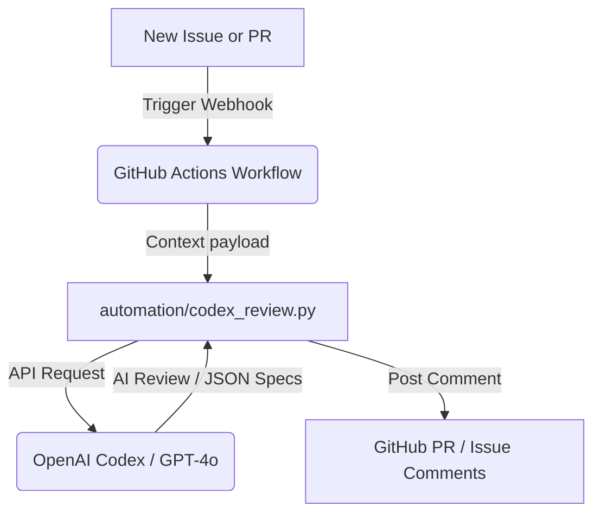

# 🏭 ACME Bottles Production Manager & Automation Engine

[](https://github.com/psw20445-commits/acme-bottles/actions/workflows/ci.yml)
[](https://github.com/psw20445-commits/acme-bottles/actions/workflows/codex_bot.yml)
[](https://opensource.org/licenses/MIT)
[](https://www.python.org/)

An open-source, compact supply chain and production scheduling system designed for plastic bottle manufacturing, powered by an automated AI review engine. 

The system manages raw material supplies, purchase orders, and live production schedules utilizing rigid industrial constraints (FIFO queues, dedicated production lines, material reservation mechanisms, and ETA-based delay tracking).

---

## 🤖 Maintainer Automation: Codex Integration (Strategy C)

To ease the burden on open-source maintainers, ACME Bottles features a native **Codex-powered GitHub automation bot** (`automation/codex_review.py`). This bot automatically monitors incoming Pull Requests and Issues:

1. **Automated PR Reviews**: Checks code modifications for scheduling engine compliance (verifying FIFO preservation, line capacities, and material calculation invariants).
2. **Issue-to-API Parsing**: Evaluates supply and purchase request issues, automatically generating formatted JSON payloads compatible with the ACME planning engine to streamline input ingestion.



---

## ⚡ Core Business & Scheduling Rules

ACME Bottles operates under explicit industrial manufacturing constraints:

*   **Production Capability**:
    *   `1-Liter Line`: Dedicated to 1-Liter Bottles (Capacity: 2,000 bottles/hour).
    *   `1-Gallon Line`: Dedicated to 1-Gallon Bottles (Capacity: 1,500 bottles/hour).
*   **Material Recipes**:
    | Product | PET Resin | PTA | Ethylene Glycol |
    | :--- | :---: | :---: | :---: |
    | **1-Liter Bottle** | 20g | 15g | 10g |
    | **1-Gallon Bottle** | 65g | 45g | 20g |
*   **Scheduling Algorithm**:
    *   **FIFO Processing**: Orders are processed sequentially based on purchase order timestamp.
    *   **Line Queuing**: Jobs queue up independently, pushing expected start times for downstream orders.
    *   **Material Reservation**: Materials are allocated in order. If inventory (current + expected supply ETAs) cannot cover a job, it is flagged as `Unable to fulfill`.

---

## 🏗️ Architecture

```txt
├── .github/
│   ├── ISSUE_TEMPLATE/       # Structured bug and feature templates
│   ├── workflows/
│   │   ├── ci.yml            # Linting and testing quality gates
│   │   └── codex_bot.yml     # Codex-powered automation worker
│   └── PULL_REQUEST_TEMPLATE.md
├── automation/
│   └── codex_review.py       # OpenAI-driven review & ingestion script
├── public/                   # Frontend SPA Operational Dashboard
│   ├── index.html            # Core DOM structure
│   ├── styles.css            # Dark-mode dashboard styling
│   └── app.js                # Web client layer
├── server/                   # Backend Scheduling & API Engine
│   ├── app.py                # Fast Python-native HTTP server
│   ├── db.py                 # SQLite schema layer
│   ├── scheduler.py          # Core math and invariant scheduling solver
│   ├── seed.py               # Sample industrial scenario database seeder
│   └── tests/                # Domain constraint verification test suite
└── CONTRIBUTING.md           # OSS onboarding instructions
```

---

## 🚀 Quick Start (Local Run)

### Prerequisite
*   Python 3.10+ (No external package dependencies required for the base application)

### Run Application
1. Start the server:
   ```bash
   python server/app.py
   ```
2. Open your browser and navigate to:
   ```txt
   http://127.0.0.1:8000
   ```
   *Note: The SQLite database (`data/acme_bottles.sqlite3`) will automatically initialize and seed on the first run.*

### Resetting Demo Data
To restore the sample planning state (`2026-02-17` demo baseline):
```bash
python server/seed.py
```

---

## 🧪 Verification & Testing

We enforce rigorous unit test coverage around the scheduling invariants in `server/scheduler.py`.

Run the test suite:
```bash
python -m unittest discover -s server/tests
```

The test suite validates 10 core constraints, including:
- Dedicated queue assignment and parallel timeline execution.
- FIFO depletion blocking downstream allocation.
- Out-of-stock cutoff points versus incoming ETAs.

---

## 🤝 Contributing

We welcome open-source contributions! Please review [CONTRIBUTING.md](file:///c:/Users/psw20/Downloads/acme-bottles/CONTRIBUTING.md) to learn about our development process, styling guides, and PR verification workflows.

---

## 📄 License

This project is licensed under the MIT License - see the LICENSE file for details.
